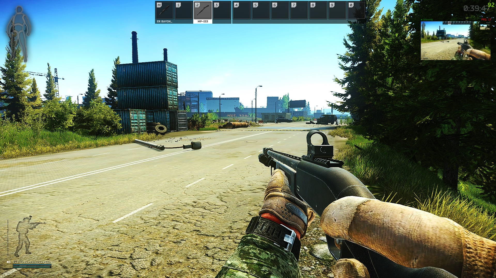
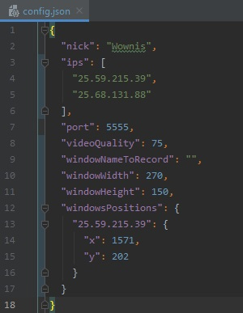
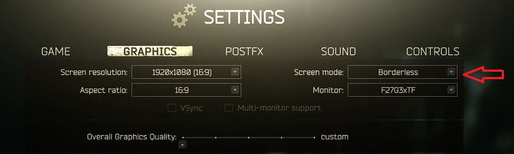
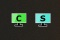

# LookAtMe
Share screen with your teammates

# About project:
This program was created to improve cooperation within your teammates in Escape From Tarkov. It works like you and your colleagues sitting in the same room. You can see live what your teammates are doing with low latency.

# How to run:

1. Connect with your teammates via **Hamachi**:
2. Copy **IPv4 address** from Hamachi of users you want to watch to **config** file:
3. Set your **nickname** in **config.json**
4. Set rest of settings in **config.json** or you can leave it default:

- **port**: connection port default is 5555
- **videoQuality**: values from 0-100 - level of jpeg compression default 75 (recomended to not changing) You can lower it when you have network performance issues.
- **windowName**: window which will be recorded. If you want to stream only specific window set it e.g "Escape From Tarkov". In this case your colleagues will see a black screen and your nickname turn yellow when you exit to the desktop or window will lose focus. You can stream any other window. To get specific window name use Windows Task Manager. If you want to record anyting just leave it "".
- **windowsPositions**: saved position of windows.

5. Change **video settings** in Tarkov:

- change **Screen Mode** to **"borderless"**
- **save** and **restart**

6. Run **server.exe** and **client.exe**
- afrer runing 2 icons should apear in tray:

- you can **close** program by right clicking icon in tray and click **"Quit"**

# Keybindings:
 - **F9 - F12** - show/hide window 1-4
 - **mouse wheel** - zoom to 100% - you can change it to another key, you can check aviable key codes in **key_codes.txt**
